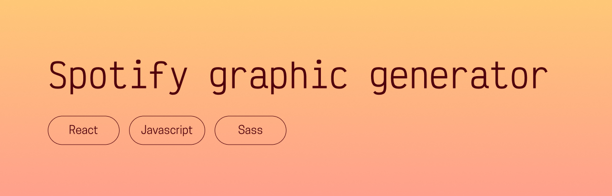

## Presentation
This is an app I made in order to create graphics for podcast episodes from Spotify. I listen to a lot of Dungeons & Dragons podcasts, and I like tracking which episodes I've listened. Up until now, I took a screenshot when I finished an episode and added it to my tracker, but it was honestly cumbersome, and I could rarely see the entire episode title – so I built this in order to easily have access to clean graphics to add to my tracker instead! You can see the entire app [here](https://spotifygraphicgenerator.chloeadrian.dev)!

## Prerequisites
- [NodeJS (version 20.6.1)](https://nodejs.org/en/)
- [NPM (version 9.8.1)](https://www.npmjs.com/)
- [React (version 19.1.0)](https://react.dev/)

## Getting started
- Run `$ npm install` to install all dependencies
- Run `$ npm start` to see the project!

## Thanks for reading, and happy coding!  
Chloé Adrian